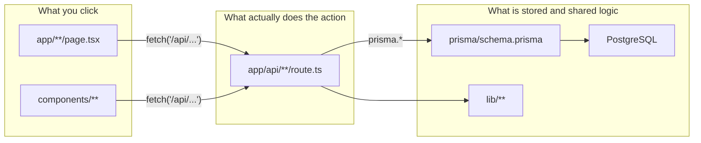
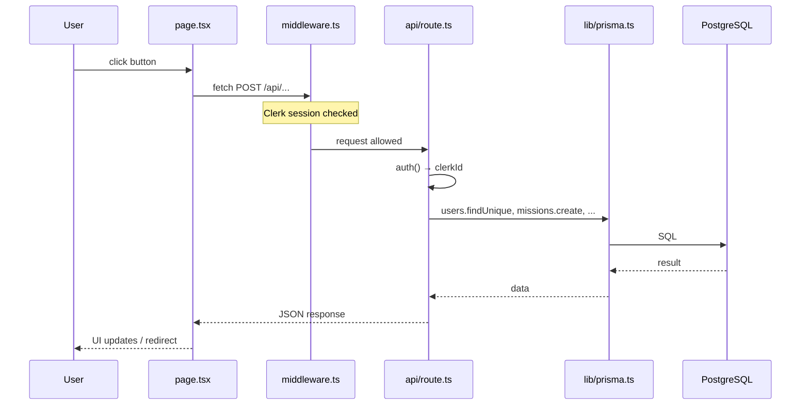

# Code study guide — Freelance Marketplace (TFE)

This document helps you **learn where actions live in the codebase** without relying on AI for every answer. Use it as your personal map: fill in the blanks as you trace flows yourself.

**Related docs (product behaviour, not file paths):**

- [README.md](../README.md) — product overview and key flows
- [docs/README.md](./README.md) — conflict resolution (detailed)
- [docs/oral-exam-questions.md](./oral-exam-questions.md) — oral exam questions (Easy / Medium / Hard) for flashcards
- [docs/QA.md](./QA.md) — teacher Qs: Notification cardinalities; ClerkId / two User ids; gracePeriodEnd
- [docs/db.md](./db.md) — diagram = dictionary = DB (traps, cardinalities, what to say)
- [docs/commands.md](./commands.md) — terminal commands for the oral (dev, Studio, migrate)
- [prisma/schema.prisma](../prisma/schema.prisma) — database models (source of truth)

---

## 1. Stack in one paragraph

This app is a **Next.js App Router** project. Users sign in with **Clerk**. The UI lives in `app/**/page.tsx` and `components/**`. When you click a button, the page usually calls **`fetch('/api/...')`**, which hits a file under **`app/api/**/route.ts`**. That API route uses **Prisma** (`lib/prisma.ts`) to read/write **PostgreSQL**. Shared business logic (crypto, payouts, auth helpers) sits in **`lib/`**. Route protection and roles are partly handled in **`middleware.ts`**.

---

## 2. How this codebase is organized (mental model)

Three layers. Memorise this before diving into individual files.

### 2.1 Layer diagram



**ASCII version** (if Mermaid does not render in your viewer):

```
┌─────────────────────────────────────────────────────────────┐
│  UI — what you click                                        │
│  app/**/page.tsx          components/**                     │
└──────────────────────────────┬──────────────────────────────┘
                               │  fetch('/api/...')
                               ▼
┌─────────────────────────────────────────────────────────────┐
│  API — where actions run                                    │
│  app/api/**/route.ts   (GET, POST, PATCH, DELETE)           │
└──────────────────────────────┬──────────────────────────────┘
                               │  prisma.*  +  lib/*
                               ▼
┌─────────────────────────────────────────────────────────────┐
│  Data — models + database                                   │
│  prisma/schema.prisma  →  PostgreSQL                        │
└─────────────────────────────────────────────────────────────┘
```

### 2.2 One request, start to finish

When a user clicks “Submit” on a form:



**Rule of thumb:** **Page → API → Prisma → tables.** Pages almost never talk to the database directly.

### 2.3 Quick reference — “I want to find…”

| You want to find… | Look here |
|-------------------|-----------|
| A **screen** (URL) | `app/.../page.tsx` |
| The **action** (create, accept, pay, resolve…) | Matching `app/api/.../route.ts` |
| **Database tables / fields** | `prisma/schema.prisma` |
| **Reusable business logic** (crypto, payouts, auth helpers) | `lib/` |
| **Reusable UI** (forms, dialogs, nav, notifications) | `components/` |
| **Who is logged in** (session) | Clerk + `middleware.ts` + `auth()` in API routes |
| **Current user row in DB** | `GET /api/me` → `app/api/me/route.ts` |
| **Role / route permissions** | `middleware.ts`, `lib/hooks/useUserRole.ts` |
| **Demo / test data** | `prisma/seed.ts` |

### 2.4 How URL maps to files

Next.js App Router uses **folders = routes**:

| Browser URL | File |
|-------------|------|
| `/` | `app/page.tsx` |
| `/missions` | `app/missions/page.tsx` |
| `/missions/new` | `app/missions/new/page.tsx` |
| `/missions/abc-123` | `app/missions/[id]/page.tsx` |
| `POST /api/missions` | `app/api/missions/route.ts` |
| `PATCH /api/offers/xyz` | `app/api/offers/[id]/route.ts` |

The **API path mirrors the folder path** under `app/api/`.

### 2.5 Main folders (project tree)

```
freelanceMarketplace/
├── app/                        # Routes: pages + API
│   ├── page.tsx                # Home
│   ├── layout.tsx              # Global layout (nav, providers)
│   ├── missions/               # Mission pages
│   ├── contracts/              # Contract pages
│   ├── payments/               # Payment pages
│   ├── conflicts/              # Conflict list / detail
│   ├── messages/               # Messaging UI
│   ├── admin/                  # Admin-only pages
│   └── api/                    # All backend endpoints
│       ├── missions/
│       ├── offers/
│       ├── contracts/
│       ├── payments/
│       ├── conflicts/
│       ├── conversations/
│       ├── notifications/
│       └── admin/
├── components/                 # Shared React UI
├── lib/                        # prisma client, crypto, hooks, auth helpers
│   ├── prisma.ts               # DB client (imported by API routes)
│   └── hooks/                  # useUserRole, useUnreadMessages, ...
├── prisma/
│   ├── schema.prisma           # Data model — align with class diagram
│   ├── seed.ts                 # Sample data
│   └── migrations/             # DB change history
├── middleware.ts               # Auth + role-based route guards
└── docs/                       # Documentation (including this file)
```

### 2.6 Product areas → where they live

| Product area | Pages (UI) | API |
|--------------|------------|-----|
| Missions | `app/missions/` | `app/api/missions/` |
| Offers / applications | `app/offers/`, `app/missions/[id]/apply/` | `app/api/offers/` |
| Contracts | `app/contracts/` | `app/api/contracts/` |
| Payments / escrow | `app/payments/`, `components/PaymentForm.tsx` | `app/api/payments/` |
| Conflicts | `app/conflicts/`, `components/Conflict*.tsx` | `app/api/conflicts/` |
| Messaging | `app/messages/` | `app/api/conversations/` |
| Notifications | `components/InAppNotifications.tsx` | `app/api/notifications/` |
| Portfolio | `app/portfolios/` | `app/api/portfolios/`, `app/api/projects/` |
| Admin | `app/admin/` | `app/api/admin/` |
| Chatbot (no DB) | `components/ChatbotWidget.tsx` | `app/api/chatbot/` |

### 2.7 Prisma Studio vs class diagram (defence)

Studio and PostgreSQL use **table names**. The class diagram uses **UML class names**. Same model, different labels.

**`User` vs `users`:** the diagram class **User** is the table **`users`**. In code: `prisma.users.findUnique(...)`. Not a missing class.

**Long names like `users_conflicts_reporterIdTousers`:** these are **not extra tables or classes**. They are Prisma **relation fields** so you can click from a conflict to a user. They appear when **several foreign keys** point to the same `users` table (Prisma cannot call them all `users`).

| Prisma / Studio name | FK column | Diagram association |
|----------------------|-----------|---------------------|
| `users_conflicts_reporterIdTousers` | `reporterId` | User **Report** Conflict (who signalled) |
| `users_conflicts_assignedAdminIdTousers` | `assignedAdminId` | User **assigned admin** / solve |
| `users_contracts_freelancerIdTousers` | `freelancerId` | Contract **builder** |
| `users_contracts_adminIdTousers` | `adminId` | Contract **admin** |
| `users_missions_clientIdTousers` | `clientId` | User **Create** Mission |

Physical data = the short FKs. Studio’s long names = navigation helpers.

**Say this:** *Ce ne sont pas des classes en plus. Ce sont les relations Prisma vers User. Sur le diagramme on les nomme Report / Solve ; en base ce sont reporterId et assignedAdminId.*  
**EN:** *These are not extra classes. They are Prisma’s names for links to User when there are several foreign keys. The diagram uses association names; the database uses short FK columns.*

Renaming them to `reporter` / `assignedAdmin` in `schema.prisma` would be cosmetic, not required for the TFE.

---

## 3. How to learn fast (do this yourself)

### Method A — Browser Network tab (best ROI)

1. Run `npm run dev` and open [http://localhost:3000](http://localhost:3000).
2. Open DevTools → **Network**.
3. Perform **one** user action (e.g. create mission, accept offer).
4. Find the **`/api/...`** request (method + path).
5. Open the matching file under `app/api/`.
6. Search for `prisma.` in that file — that is what changes in the database.

Repeat once per core flow. ~15 minutes per flow beats hours of random browsing.

### Method B — Search the repo (low AI)

| Search for | You learn |
|------------|-----------|
| `fetch('/api/missions` | Which pages call the missions API |
| `prisma.offers.create` | Where offers are created |
| `conflict_created` | Where conflict notifications are written |
| `export async function POST` in `app/api/` | Entry points for create actions |

Use your IDE search or: `rg "fetch\('/api/offers" app/`

### Method C — Anchor on the schema

When you see `prisma.contracts.update`, open the `contracts` model in `schema.prisma`. Your **class diagram** and the **running code** meet there.

### Method D — One flow per study session

Do not try to memorise every file. Cover **one journey per session**, then write it in section 5 below.

---

## 4. Five core flows to learn first

Master these and you understand most of the architecture.

| # | Flow | Typical URL | API (start here) |
|---|------|-------------|------------------|
| 1 | Client posts a mission | `/missions/new` | `POST /api/missions` |
| 2 | Builder applies | `/missions/[id]/apply` | `POST /api/offers` |
| 3 | Client accepts → contract | `/missions/[id]/applications` | `PATCH /api/offers/[id]` |
| 4 | Payments / escrow / release | `/contracts`, `/payments` | `/api/payments`, `/api/payments/[id]/release*` |
| 5 | Report / resolve conflict | `/contracts/[id]`, `/conflicts` | `POST /api/conflicts`, `POST /api/conflicts/[id]/resolve` |

### Secondary flows (after the five above)

| Area | URL / component | API |
|------|-----------------|-----|
| Messaging | `/messages` | `/api/conversations`, `/api/conversations/[id]/messages` |
| In-app notifications | `InAppNotifications` | `GET /api/notifications`, `PATCH /api/notifications/[id]/read` |
| Admin verify mission | `/admin/verify-missions` | `POST /api/missions/[id]/verify` |
| Portfolio | `/portfolios` | `/api/portfolios`, `/api/projects` |
| Reviews | `/reviews` | `/api/reviews` |
| Chatbot (not in DB) | `ChatbotWidget` | `POST /api/chatbot` |

---

## 5. Flow trace template (copy per feature)

Fill this **yourself** after tracing in Network + code. Empty copies are intentional — that is how you prove you understand.

```markdown
### [Flow name]

- **User role:** client | builder | admin
- **URL:**
- **UI file:** `app/.../page.tsx` or `components/...`
- **API:** METHOD `/api/...`
- **API file:** `app/api/.../route.ts`
- **Prisma models touched:** e.g. missions, offers, contracts
- **What changes in the DB:** (one sentence in your own words)
- **Tested on:** YYYY-MM-DD
- **Notes / edge cases:**
```

---

## 6. Worked example — Client posts a mission

Use this as a model for the other flows. **Verify** by opening the files and clicking through locally.

| Step | Detail |
|------|--------|
| URL | `/missions/new` |
| UI | `app/missions/new/page.tsx` |
| Loads categories | `GET /api/categories-skills` → `app/api/categories-skills/route.ts` |
| Loads current user | `GET /api/me` → `app/api/me/route.ts` |
| Submit | `POST /api/missions` → `app/api/missions/route.ts` |
| DB | Creates row in `missions`; links `categories`, `skills` (M:N) |
| After create | Mission often needs **admin verification** before going live (`isVerified`) |

**Your turn:** trace `POST /api/missions` and list every `prisma.*` call you find.

---

## 7. Worked example — Builder applies to a mission

| Step | Detail |
|------|--------|
| URL | `/missions/[id]/apply` |
| UI | `app/missions/[id]/apply/page.tsx` |
| Load mission | `GET /api/missions/[id]` |
| Submit application | `POST /api/offers` → `app/api/offers/route.ts` |
| DB | New row in `offers` (`status` typically `PENDING`) |

---

## 8. Worked example — Client accepts offer (contract created)

| Step | Detail |
|------|--------|
| URL | `/missions/[id]/applications` |
| UI | `app/missions/[id]/applications/page.tsx` |
| List applications | `GET /api/offers?missionId=...` |
| Accept | `PATCH /api/offers/[id]` with `status: 'ACCEPTED'` → `app/api/offers/[id]/route.ts` |
| DB | Creates or re-activates `contracts` (one per mission); mission → `IN_PROGRESS`; other pending offers cancelled |

**Note:** One mission has at most **one** contract row (`missionId` unique on `contracts`).

---

## 9. Worked example — Payments

| Step | Detail |
|------|--------|
| UI | `components/PaymentForm.tsx`, `app/contracts/page.tsx`, `app/payments/page.tsx` |
| Create payment | `POST /api/payments` → `app/api/payments/route.ts` |
| Verify (admin) | `POST /api/payments/[id]/verify` |
| Release funds | `POST /api/payments/[id]/release` or `.../release-milestone` |
| DB | `payments`, `currencies`; contract/mission status may update |
| Docs | [payment-workflow.md](./payment-workflow.md), [escrow-system-explained.md](./escrow-system-explained.md) |

---

## 10. Worked example — Conflicts

| Step | Detail |
|------|--------|
| Report | `components/ConflictReportDialog.tsx` → `POST /api/conflicts` |
| API | `app/api/conflicts/route.ts` |
| List | `/conflicts` → `GET /api/conflicts` |
| Resolve | `app/api/conflicts/[id]/resolve/route.ts` |
| DB | `conflicts`, `conversations`, `conversation_participants`, `messages`, `notifications` |
| Product doc | [docs/README.md](./README.md) |

---

## 11. Auth and roles

| Piece | Role |
|-------|------|
| Clerk | Login/sign-up; `userId` in API via `auth()` from `@clerk/nextjs/server` |
| `middleware.ts` | Protects routes; role-based path patterns |
| `users.id` | **Primary key** of User (UUID generated by Peak). All FKs in this DB point here (`clientId`, `reporterId`, …). |
| `users.clerkId` | Unique **external id** from Clerk (`user_…`). Used only to find our row after `auth()`. **Not** a second PK. **Not** a foreign key. |
| `users.email` | Copy of Clerk’s email (unique). Login password stays in Clerk; we do not use `users.password` to sign in. |
| `users.roleId` | **Foreign key** → `roles.id`. Exactly **one** platform role per user. |
| Client vs builder | **Behaviour**: Mission/Offer relations — **not** extra Role rows. |

**Common API pattern:**

```ts
const { userId } = await auth();
const user = await prisma.users.findUnique({ where: { clerkId: userId } });
// then use user.id as FK everywhere else
```

### 11.1 Why both `id` and `clerkId`? (defence)

Teacher question: *Why ClerkId? Why two ids on User? How are they connected?* Full short answer: [QA.md](./QA.md) Q2.

UML / “one id per class”: **yes**. The identifier of User is **`id`**. `clerkId` is an **attribute** (unique), like `email`. Not a second primary key.

**On utilise l’API Clerk pour la v1.** Clerk gère l’identité (inscription, session, e-mail). PostgreSQL conserve le **profil**.

**Clerk gère :**

- inscription et connexion : formulaires, mot de passe haché ;
- session : rester connecté, cookie, déconnexion ;
- e-mail : vérification de l’adresse et réinitialisation du mot de passe ;
- compléments : synchronisation de la photo de profil.

Clerk and PostgreSQL are two systems. Clerk does not use our UUID; our tables do not use `user_abc` as PK.

**How they connect after login**

1. `auth()` → Clerk id (`user_…`).
2. `findUnique({ where: { clerkId: userId } })` → our `users` row.
3. All other tables use **`users.id`** as FK. `clerkId` is not reused.

```
Compte Clerk  --clerkId (unique attr)-->  ligne users (PK = id)  --id-->  missions, contracts, …
```

| Column | PK / FK? | Unique? | Points to |
|--------|----------|---------|-----------|
| `users.id` | **PK** | yes | this row |
| `users.clerkId` | neither | yes | Clerk (**outside** this database) |
| `users.roleId` | **FK** | no | `roles.id` |
| `missions.clientId` | **FK** | no | `users.id` |

A **foreign key** references another **table in this database**. There is no `clerk` table, so PostgreSQL cannot enforce a FK to Clerk. We did not use Clerk’s id as PK so Peak does not depend on the auth provider.

**Say this:** *On n’a pas deux clés primaires. UserId est la PK. ClerkId sert seulement à l’authentification, pour retrouver ce UserId après login. Clerk gère l’identité ; PostgreSQL garde le profil. Les autres tables sont liées par UserId. `clerkId` n’est pas une FK.*  
**EN:** *Not two primary keys. UserId is the PK. ClerkId is only used at authentication to find that UserId after login. Clerk handles identity; PostgreSQL stores the profile. Other tables link with UserId. clerkId is not a FK.*

---

## 12. Messaging and read state (for class diagram / defence)

| Concept | Where |
|---------|--------|
| Thread | `conversations` |
| Who is in the thread | `conversation_participants` (`lastReadAt`, `isActive`) |
| Message body | `messages` (`content`, `isRead`, `status`) |
| UI | `app/messages/page.tsx`, `components/ConflictMessaging.tsx` |
| API | `app/api/conversations/[id]/messages/route.ts` |

- **`messages.isRead`** — per-message flag (bulk-updated when thread opened).
- **`conversation_participants.lastReadAt`** — per-user “last caught up” in this thread.
- **`notifications.readAt`** — separate: inbox alerts, not chat.

### 12.1 Conflict Notification (DB) vs mission “badge” (no inbox row)

Two different mechanisms. Only one uses the **Notification** class / `notifications` table.

**Conflict — real Notification (persisted)**

1. User reports a dispute on a contract.  
2. `POST` `app/api/conflicts/route.ts` runs `prisma.$transaction`:  
   - insert **Conflict**  
   - insert **Conversation** + participants  
   - insert **`notifications`** rows (`type: conflict_created`) for client, builder, admin  
3. If the inbox insert failed, the conflict would be “invisible” — that is why it is in the same SQL transaction.  
4. UI: `InAppNotifications` → `GET /api/notifications`. User marks read via `readAt`.

Diagram: **Conflict 0..1 — 1..\* Notification** (a report always creates ≥1 inbox row; a *payment* alert can have `conflictId` null).

**Mission create — not a Notification**

1. Client publishes a listing.  
2. `POST` `app/api/missions` inserts **Mission** with `isVerified = false`.  
3. **No** `notifications.create`. Nothing is linked in the inbox table.  
4. Admin UI (`MissionVerificationNotification.tsx`, name is misleading) **counts** missions where `isVerified === false` (`GET /api/admin/missions` or unverified count). That number is computed **when the page loads**, not stored as an alert.

Diagram: **Mission 0..1 — 0..\* Notification** (zero rows at create; later a payment/conflict *may* set `missionId` on a real inbox row).

**Teacher trap — why 0..\* on Mission vs 1..\* on Conflict (Notification side):** not a drawing error. Conflict report **always** writes ≥1 inbox row in the same `$transaction`. Mission **create** writes **zero**. Later events can add several. Full answer: [QA.md](./QA.md).

| | Conflict report | Mission create |
|--|-----------------|----------------|
| Table `notifications` | **Yes** | **No** |
| What the admin sees | Inbox item (`conflict_created`) | Badge / list of unverified missions |
| Source of truth | New rows + `conflictId` | `missions.isVerified` |
| Read state | `notifications.readAt` | None (not an inbox item) |

**When a mission *does* get a real Notification** (`missionId` set — still the inbox, not the badge):

| Event | `type` |
|-------|--------|
| Conflict reported / resolved | `conflict_created`, `conflict_resolved` |
| Client releases payment / milestone | `payment_released`, `milestone_released` |
| Admin must complete off-chain payout | `payout_action_required` |
| Admin marks payout done | `payout_completed` |

Not inbox: fund escrow (`MADE`), verify listing, Check Deadlines / `status` `OVERDUE`.

**Why two mechanisms (badge vs inbox):** Notification = **event** (“look now”). Badge = **count** of `isVerified = false` (moderation queue). Do not insert fake inbox rows on create just to match Conflict’s 1..\*.

**Why this choice:** Notification = “look at this **now**.” A dispute is an alert. A new listing is a **moderation queue**. Aligning both to `1..\*` would mean inserting fake inbox rows on every mission — different métier, not a diagram bug.

**Say this:** *À la création d’une mission, aucune Notification n’est écrite. L’admin voit un badge calculé sur isVerified. Un conflit, lui, insère vraiment des lignes notifications dans la même transaction SQL que le conflit. D’où Mission 0..\* et Conflict 1..\* du côté Notification.*  
**EN:** *Creating a mission does not insert Notification rows. The admin badge is a count of unverified missions. A conflict does insert inbox rows in the same SQL transaction as the conflict. That is why Mission is 0..\* and Conflict is 1..\* on the Notification side.*

---

## 13. What is **not** persisted (mention in TFE, not on class diagram)

| Feature | Where | Stored in DB? |
|---------|--------|----------------|
| Chatbot FAQ / LLM | `app/api/chatbot/route.ts`, `components/ChatbotWidget.tsx` | No |
| Wallet connect UI | `components/WalletConnect.tsx`, `lib/wagmi.ts` | Only user wallet fields on `users` |

---

## 14. Admin area

| UI | API prefix |
|----|------------|
| `app/admin/*` | `app/api/admin/*` |

Examples: verify missions, manage users, mark payouts completed, overdue checks.

### 14.1 `gracePeriodEnd` (defence)

Teacher Q: [QA.md](./QA.md) Q3.

At **create** (`POST /api/missions`): `deadline` = start + `timeframe` days; grace = 25 % of timeframe; `gracePeriodEnd` = deadline + grace.

Admin **Check Deadlines** (`POST /api/admin/check-deadlines`) is **not** a cron. Past `deadline` → `status = OVERDUE`. **OVERDUE = late work**, not a late payment (`payments.status` is separate). Past `gracePeriodEnd` → **review list only**. The web app does **not** auto-refund. There is no `isOverdue` or `autoRefundEnabled` column (both were unused duplicates in V1).

**Say this:** *OVERDUE = deadline de travail dépassée, pas un paiement en retard. La grâce est une date stockée, 25 % après. Pas de remboursement automatique. L’admin lance Check Deadlines, puis décide.*

---

## 15. One-page cheat sheet (revision before defence)

```
URL          → app/.../page.tsx
Action       → app/api/.../route.ts  (GET POST PATCH DELETE)
Data         → prisma/schema.prisma
Shared code  → lib/
UI pieces    → components/

Trace: Click → Network → /api/X → route.ts → prisma. → table

5 flows: mission → offer → contract → payment → conflict
```

**Architecture closer**

- **FR:** *L’architecture est en trois couches : les pages Next.js appellent des routes `/api`, qui passent par Prisma vers PostgreSQL. L’identité vient de Clerk, le rôle métier est une ligne dans `roles` (un rôle par utilisateur). Les discussions sont des Message dans une Conversation ; les alertes sont des Notification. Le badge « missions à vérifier » est de l’UI sur Mission.isVerified, pas une Notification.*
- **EN:** *The architecture has three layers: Next.js pages call `/api` routes, which use Prisma to talk to PostgreSQL. Identity comes from Clerk; the platform role is one row in `roles` (exactly one role per user). Chats are Message objects inside a Conversation; alerts are Notification objects. The “missions to verify” badge is UI on Mission.isVerified, not a Notification.*

---

## 16. Using AI without cheating yourself

**Good uses**

- “I traced accept-offer to `app/api/offers/[id]/route.ts` — what does the `ACCEPTED` branch do?” (you did the trace first)
- “Is my flow table correct?” (verification)
- Empty template → you fill → ask for a check

**Weak uses**

- “Explain the entire codebase” without opening files
- Pasting this doc into a report without running the flows yourself

**For the jury:** walking one flow live in the repo (page → API → Prisma) is worth more than any generated essay.

---

## 17. Study checklist

- [ ] I can explain page → API → Prisma without looking
- [ ] Flow 1: Create mission — traced and filled template
- [ ] Flow 2: Apply (offer) — traced and filled template
- [ ] Flow 3: Accept offer / contract — traced and filled template
- [ ] Flow 4: Payment / release — traced and filled template
- [ ] Flow 5: Conflict — traced and filled template
- [ ] I know where `schema.prisma` fits vs class diagram
- [ ] I know what is **not** in the database (chatbot)
- [ ] I practised explaining one flow out loud in &lt; 3 minutes

---

## 18. Your notes (blank)

_Add discoveries, exam questions, and file paths you had to look up more than once._

```
Date:
Topic:
What I learned:
Files:
Still unclear:
```

---

## 19. Is the project properly structured? (audit + improvement ideas)

**Overall verdict: yes, the big picture is sound.** The three-layer split (pages → API routes → Prisma) follows Next.js App Router conventions, the API folders mirror product areas, and shared logic lives in `lib/`. A jury member reading `app/api/` can guess what the product does — that is a good sign.

That said, the repo shows its history. Below are concrete cleanups, ordered by value. None are urgent for the TFE, but knowing them (and mentioning a few in your report as "known technical debt") shows maturity.

### 19.1 Dead / duplicate files (easy wins)

| Issue | Detail |
|-------|--------|
| Two Prisma clients | `lib/prisma.ts` (used everywhere) **and** `lib/db.ts` (only imported by `app/api/test-services-auth/route.ts`). Delete `lib/db.ts` and its one usage. |
| Nested duplicate components | `components/components/ui/button.tsx` and `card.tsx` are never imported — accidental copies of `components/ui/*`. Delete the inner `components/components/` folder. |
| Two navbars | `app/layout.tsx` imports `components/layout/navbar.tsx`; `components/Navbar.tsx` appears unused. Verify, then delete the unused one. |
| Disabled file | `components/WalletConnect.tsx.disabled` — dead code kept "just in case". Git history already preserves it; delete. |
| Misplaced util | `components/lib/utils.ts` duplicates the role of `lib/utils.ts`. Consolidate. |

### 19.2 Test and debug routes shipped with the app

These are reachable in production builds:

- Pages: `app/test/`, `app/test/portfolios/`, `app/test-button/`, `app/debug/`, `app/debug-api/`
- API: `app/api/test-auth/`, `app/api/test-services-auth/`, `app/api/debug-clerk-id/`

**Suggestion:** delete them, or gate them behind an environment check. For the TFE, being able to say "I removed debug endpoints before delivery" is a good security note.

### 19.3 Components folder could be grouped by feature

`components/` mixes ~70 files at mostly one level: generic UI (`ui/`), layout (`layout/`, `shared/`), and feature components (`ConflictMessaging.tsx`, `PaymentForm.tsx`, `MissionVerificationBadge.tsx`…). Also `app/components/MissionList.tsx` sits inside `app/` while everything else is top-level.

**Suggestion (optional):** group feature components into subfolders that mirror the product areas you already use in `app/api/`:

```
components/
  ui/            # buttons, cards, inputs (keep as is)
  layout/        # navbar, footer
  conflicts/     # ConflictMessaging, ConflictReportDialog, ...
  payments/      # PaymentForm, PaymentManagement, ...
  missions/      # MissionList, MissionVerificationBadge, ...
```

Naming is also mixed (`PaymentForm.tsx` vs `main-nav.tsx` vs `date-range-picker.tsx`). Pick one convention (PascalCase for components is the common choice) — cosmetic, low priority.

### 19.4 Role logic lives in three places

Role/permission checks exist in:

1. `middleware.ts` — `rolePermissions` route patterns
2. `lib/prisma.ts` — `getUserPermissions()` with a second permission matrix
3. Individual API routes — inline `role?.name === 'admin'` checks (e.g. `app/api/missions/route.ts`, `app/api/conflicts/route.ts`)

They can drift apart (the middleware knows a `support` role; most routes only check `admin`). **Suggestion:** one helper (e.g. `requireRole('admin')`) used by API routes, and keep the permission matrix in a single file. Good "future work" item for the report.

### 19.5 Very large page files

Some pages exceed 600–700 lines (`app/missions/new/page.tsx`, `app/contracts/[id]/page.tsx`, `app/offers/page.tsx`) because data fetching, state, and rendering live together. This is workable but hard to study.

**Suggestion:** extract data fetching into hooks (`lib/hooks/`) and split big forms into components. Do this only where you touch the code anyway — a rewrite is not worth it for the TFE.

### 19.6 Prisma naming is database-style, not Prisma-style

Models are lowercase plural (`users`, `missions`) with generated relation names like `users_contracts_adminIdTousers`. Idiomatic Prisma uses `User`, `Mission` with `@@map("users")`, giving readable code (`prisma.user.findUnique`, `contract.admin`). This came from introspecting an existing database — it is understandable, but worth one line in your report: *"Model names follow the physical schema; a future refactor could map them to PascalCase with `@@map` for readability."* Renaming now would touch nearly every API route, so do **not** do it before the defence.

### 19.7 Documentation placement

`END_OF_STUDY_FIXES.md` sits at the repo root while everything else is in `docs/`. Move it into `docs/` and link it from `docs/README.md` so all project documentation has one home.

### 19.8 Priority summary

| Priority | Action | Effort |
|----------|--------|--------|
| High | Delete debug/test routes (19.2) | 15 min |
| High | Delete `lib/db.ts`, `components/components/`, `.disabled` file (19.1) | 15 min |
| Medium | Single role-check helper (19.4) | 1–2 h |
| Medium | Group feature components (19.3) | 1–2 h |
| Low | Split large pages (19.5) | Ongoing |
| Do not do now | Rename Prisma models (19.6) | Days |

**For the defence:** knowing *why* each of these is debt — and why you chose not to fix some — is worth as much as fixing them.
